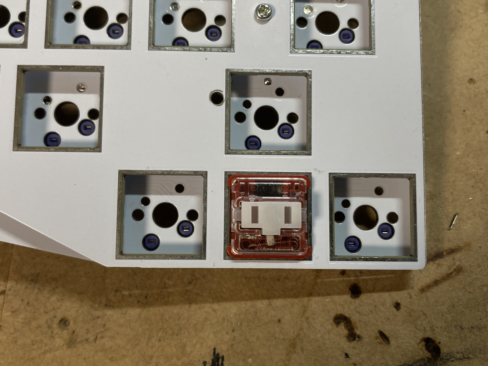

# MX Choc Converter
"Choc Switch with MX Footprints" Converter  
  
MX互換スイッチ用に設計された基板でChoc V1/V2スイッチを使用可能にする変換基板です。  
以下の注意点を確認の上ご使用ください。
- 本品ははんだづけを必要とするキットです。
- 基板・本体の改造を伴う場合があります。
- 同梱のピンヘッダの推奨取り付け穴径は「丸穴 直径0.8mm」となります。当方ではスイッチをハンダ付けする基板との対応は確認できませんのでご了承ください。
- 本品を一度でも使用したMXソケットは、通常のスイッチに対して使用することができなくなります。
- 本品を何度も使用したMXソケットは、本品に対しても接触不良を起こしやすくなります。
- 本品を使用したことにより発生した損害について、当方は一切の責任を負いません。
  
基板1枚を割ることにより、49鍵分のコンバーターを作成できます。  
60%には二つで充分ですよ。

## 必要な工具類
- はんだ作業用品一式
- マイクロニッパー
- ラジオペンチやプライヤー(必要ない場合もあります)

## 使い方
Vカットに従って基板を割ります。  
このとき、山折り・谷折りを繰り返すように力を掛けると折りやすくなります。  
通常、手で折ることができますが、硬い場合はラジオペンチやプライヤーなどで挟んでください。  
この際、基板に傷がつかないように、布などを挟むか、基板をマスキングテープで保護するなどしてください。
### バリ取り
Vカットの断面はガラス繊維でけば立っています。  
基板を折った断面どうしを並行に擦り合わせると、毛羽立ちが指に刺さるのを抑えることができます。  
さらに滑らかにしたい場合は、カッターや金属定規などの硬いもので削り取ってください。  
作業中に出る粉末を吸わないように注意してください。  

### ピンのはんだづけ
「めっきされた、丸い穴」に、「Choc」と書いてある側からピンを通し、垂直になるようにしてハンダ付けします。  
  
このとき、ピンの端が基板から飛び出さない長さになるようにしてください。  
1番のピンをはんだづけする際は、ブレッドボードやユニバーサル基板にピンをさし、1番の機構穴にもピンを刺すことで垂直にすることができます。  
なお、1番と2番の穴では、1.27mmのズレがあります。1.27mmピッチユニバーサル基板だと楽に作業できます。  
そうでない場合は、ブレッドボードやユニバーサル基板の端を利用して1番ピンが干渉しないようにしてください。  
同様の作業を2番のピンにも行います。  
  
はんだ付けが終わったら、ピンヘッダの黒い部分を抜くか砕くかして外します。  
このとき、ピンを曲げたり折らないように注意してください。
### スイッチのはんだづけ
  
「めっきされた、四角い穴」にスイッチの足を通し、すべてはんだづけします。  

### ピンの切断
Chocスイッチのピンを切断します。  
  
はんだで実装した新しいピンは、6～7割程度の長さが残るように切断します。  
目測に不安がある場合は先に「はんだ付けを行う場合」または「ソケットパッドにはんだ付けする場合」の手法で挿入し、後から切断できます。  

### 基板への実装
  
以下の3種類のどれかで実装を行います。  
おすすめは「ソケットパッドにはんだ付け」です。  

#### はんだ付けを行う場合
  
通常の作業で実装できます。  

#### (安全)ソケットパッドにはんだ付けする場合
  
本来のソケットを外し、別のワイヤーでソケットのパッドとコンバーターの足をはんだ付けします。  
リードダイオードの足などを用い、固定することで、ソケットを破損させることなく安全に実装できます。  

#### (場合により危険)ソケットに直接挿入する場合
通常のスイッチと同じようにソケットに挿入します。ピンの太さの関係から非常に硬くなっています。  
ソケットやパッドを破損しないよう、反対側から抑えて挿入してください。  
また、ピンが長く残っているとソケットを抑えている指に刺さる場合があるので注意してください。

## ソケット版について
変換基板自体にソケットを搭載するバージョンでは、組み立て手順は通常と同様で、ピンをはんだ付けした後にソケットをはんだ付けすれば使用できます。  
ただし、通常のスイッチプレート-基板間の距離では収まらないため、キーボード側の改造を行います。  
この基板を最も理想的な状態で組み立てたとしても、スイッチプレート-基板間距離を0.5mm拡張する必要があり、作業誤差を考えると1mm～1.5mmほどの余裕が欲しいため、その分の距離を稼ぐように構造部材を交換してください。  
例えば、基板とバックパネルを7mmのスペーサーのみで繋ぐキットの場合は、8～9mmのものに入れ替えることになります。  
基板とスイッチプレートの空間を3.5mmスペーサーで確保している基板は、4.5mm～5mm程度のスペーサーと入れ替えてください。  
アクリルプレートを基板とスイッチプレートの間に挟んでいる場合は、このプレートを作り直したり、スペーサーのみに入れ替える必要があります。  

## 免責事項
当方が販売した基板に対し初期不良があった場合は、作業に入る前に限り交換対応を行います。  
本品を使用したことにより発生した損害について、当方は一切の責任を負いません。  
  
初期不良と見做すのは以下の事項です。  
- パッド-スルーホール間の導通不良
- 銅箔層・生基板が露出する深さの**基板表面の**傷
- HASLのハンダでスルーホールが埋まっている場合
